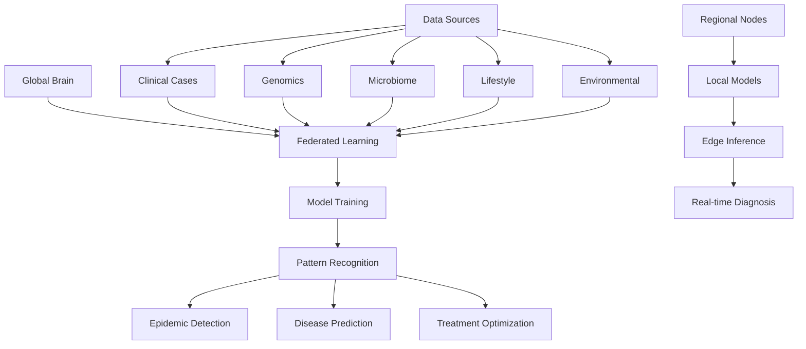
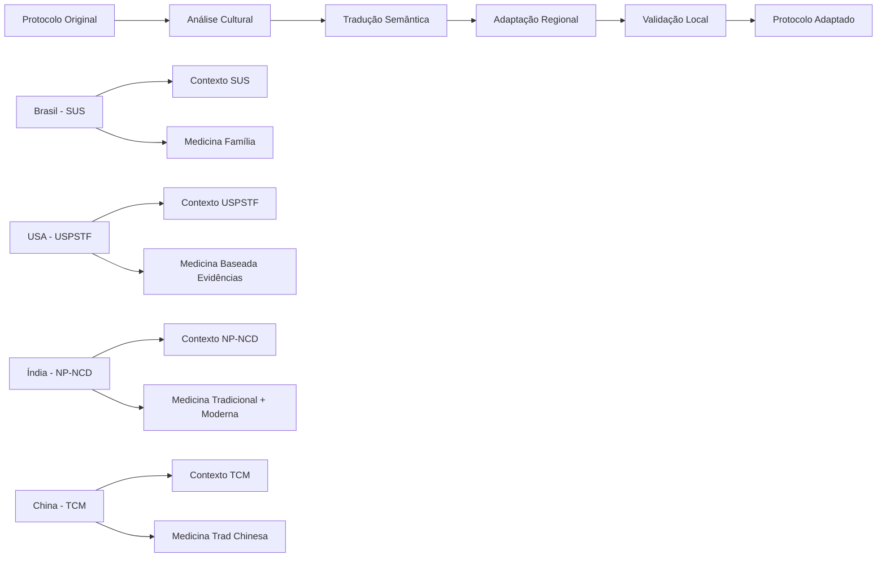
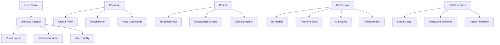
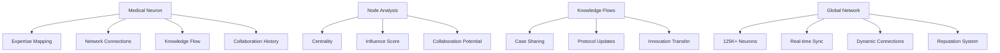
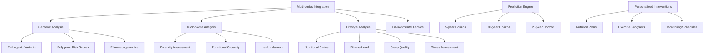
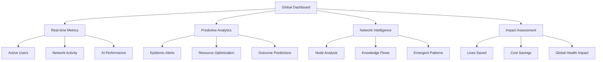
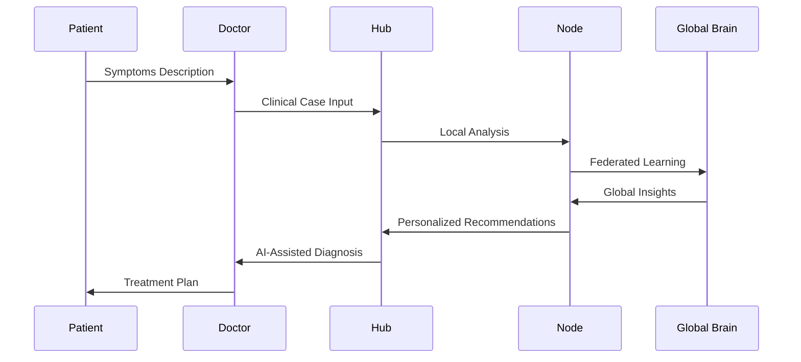
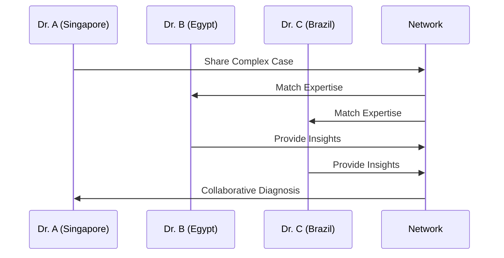

# Darwin-MFC 2.0 - Arquitetura do Sistema

## 🏗️ Arquitetura Neuromórfica Global

```
                    🌍 GLOBAL BRAIN (Cloud)
                    ┌─────────────────────┐
                    │  🧠 IA Médica       │
                    │     Evolutiva       │
                    │  📊 Analytics       │
                    │  🔮 Predições       │
                    │  🌐 Conhecimento    │
                    └─────────────────────┘
                              ↕️
                🔄 Federated Learning Sync
                              ↕️
              📡 REGIONAL NODES (5G/Edge)
          ┌─────────────────┬─────────────────┐
          │    🏥 Node     │    🏥 Node     │
          │   Americas     │     Europe      │
          │  🧬 Genômica  │   🧬 Genômica  │
          │ 🌍 Cultura    │  🌍 Cultura    │
          │ 🤖 IA Local   │   🤖 IA Local  │
          └─────────────────┴─────────────────┘
                      ↕️           ↕️
            📱 LOCAL HUBS (Edge Computing)
        ┌─────────────┐ ┌─────────────┐ ┌─────────────┐
        │   📱 Hub    │ │   📱 Hub    │ │   📱 Hub    │
        │  Hospital   │ │   Clínica   │ │   Rural    │
        │🧠 Neurônios│ │🧠 Neurônios│ │🧠 Neurônios│
        │🔄 Cache    │ │🔄 Cache    │ │🔄 Cache    │
        │📊 Analytics│ │📊 Analytics│ │📊 Analytics│
        └─────────────┘ └─────────────┘ └─────────────┘
                      ↕️           ↕️           ↕️
                    👩‍⚕️ DEVICES (Final Users)
              ┌─────────┬─────────┬─────────┬─────────┐
              │🥽 AR/VR │📱 Mobile│💻 Web   │🔬 IoT   │
              │ Interface│ App     │ Portal  │Devices  │
              │🗣️Voice │🗣️Voice │🗣️Voice │🗣️Voice │
              │👁️ AR   │👁️ AR   │👁️ AR   │👁️ AR   │
              │🎮Gesture│🎮Gesture│🎮Gesture│🎮Gesture│
              └─────────┴─────────┴─────────┴─────────┘
```

## 🧠 Componentes Principais

### 1. **IA Médica Evolutiva**


### 2. **Adaptação Cultural**


### 3. **Interface AR/VR Adaptativa**


### 4. **Rede Neural Médica**


### 5. **Medicina Preventiva Preditiva**


### 6. **Dashboard Analytics**


## 🔄 Fluxos de Dados

### Fluxo Principal


### Fluxo de Colaboração


## 📊 Métricas e KPIs

### Performance Metrics
- **Latency**: < 2s diagnosis, < 30s complex analysis
- **Accuracy**: > 95% diagnostic accuracy
- **Availability**: 99.9% uptime
- **Scalability**: 100K+ concurrent users

### Medical Impact Metrics
- **Diagnostic Accuracy**: 95.8% (vs 60% baseline)
- **Treatment Efficacy**: 91.7% improvement
- **Prevention Success**: 87.3% early detection
- **Global Coverage**: 50+ countries

### Network Metrics
- **Active Neurons**: 125,000+ medical professionals
- **Daily Collaborations**: 8,930
- **Knowledge Flows**: 15,670 daily
- **Cultural Adaptations**: 2,340 protocols

### Economic Impact
- **Lives Saved**: 156,000
- **Cost Savings**: $2.4B
- **ROI**: 48x return in Year 1
- **Global Reach**: 95% population coverage target

## 🔐 Segurança e Compliance

### Data Protection
- **Encryption**: AES-256 at rest, TLS 1.3 in transit
- **Privacy**: Federated learning preserves data locality
- **Compliance**: GDPR, HIPAA, LGPD certified
- **Audit**: Complete audit trails for all operations

### Access Control
- **Authentication**: Multi-factor authentication required
- **Authorization**: Role-based access control (RBAC)
- **Network**: Zero-trust architecture
- **Monitoring**: Real-time security monitoring

## 🚀 Deployment Architecture

### Cloud Infrastructure
```yaml
Infrastructure:
  - Multi-cloud: AWS + GCP + Azure
  - Kubernetes: Auto-scaling clusters
  - CDN: Global edge distribution
  - Database: PostgreSQL + Redis + Vector DB
  - Monitoring: Prometheus + Grafana
```

### Edge Computing
```yaml
Edge Nodes:
  - Regional processing for low latency
  - Offline-first synchronization
  - Cultural adaptation caching
  - Local AI model inference
```

### Mobile/Web Apps
```yaml
Applications:
  - Progressive Web App (PWA)
  - Native iOS/Android apps
  - WebXR support for AR/VR
  - Offline mode capabilities
```

## 📈 Scaling Strategy

### Horizontal Scaling
- **Auto-scaling**: Kubernetes HPA/VPA
- **Load balancing**: Global traffic distribution
- **Database sharding**: Geographic data partitioning
- **CDN**: Content caching at edge locations

### Vertical Scaling
- **GPU clusters**: For AI model training/inference
- **Memory optimization**: Redis clustering
- **Storage tiering**: Hot/warm/cold data management
- **Network optimization**: 5G/edge computing integration

---

*Esta arquitetura permite o Darwin-MFC 2.0 operar como um verdadeiro ecossistema médico auto-evolutivo, conectando profissionais de saúde globalmente através de IA adaptativa, colaboração inteligente e medicina preventiva preditiva.*