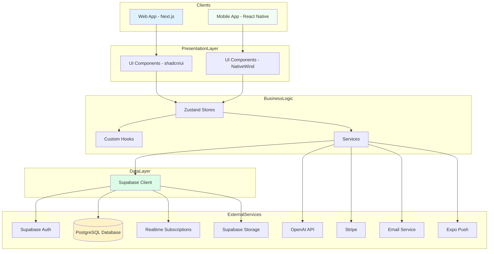
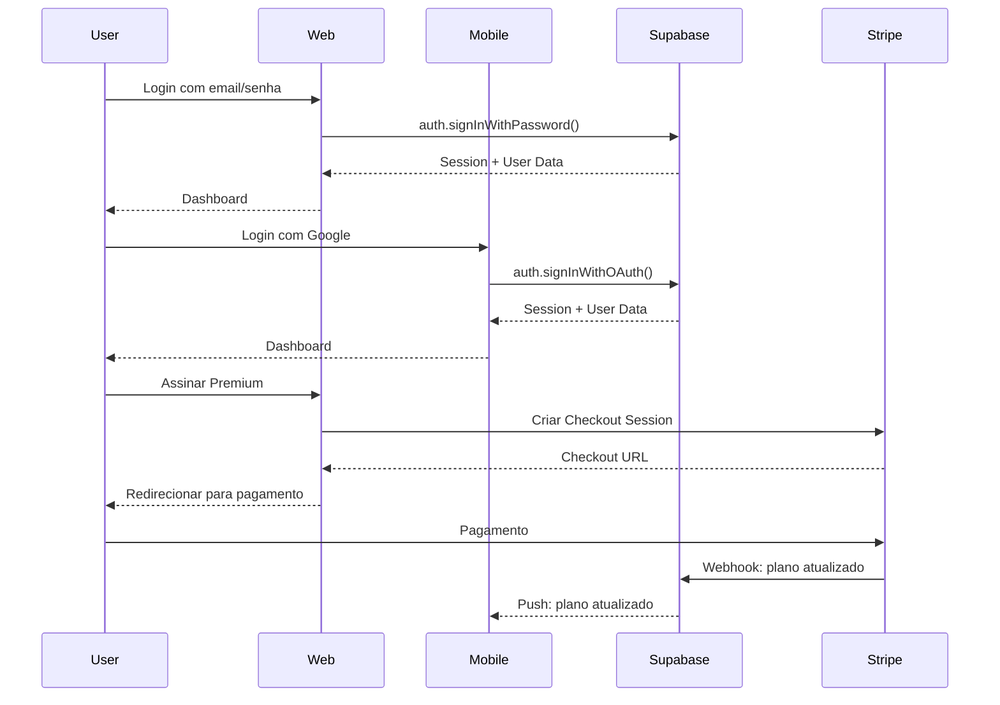
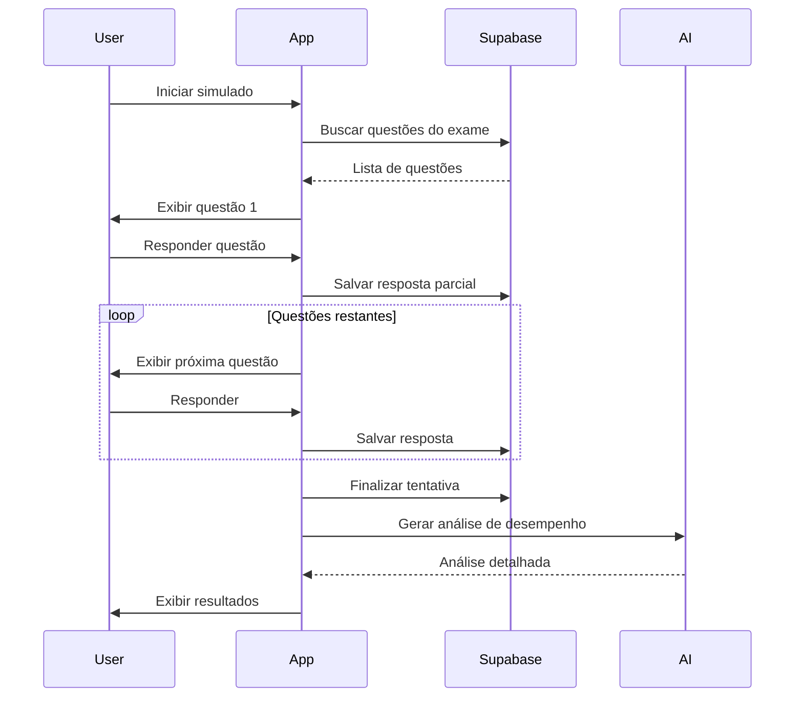
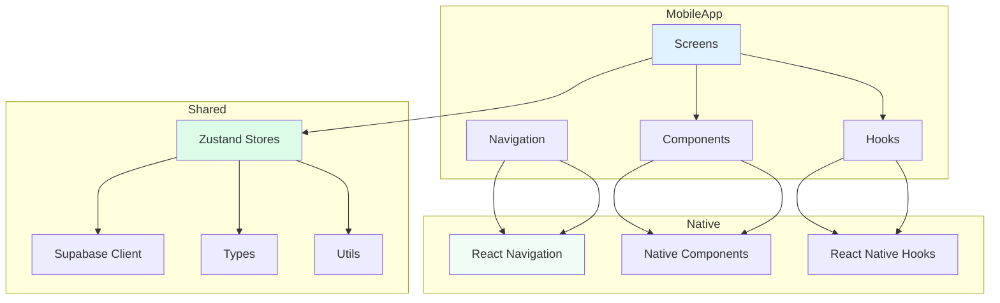
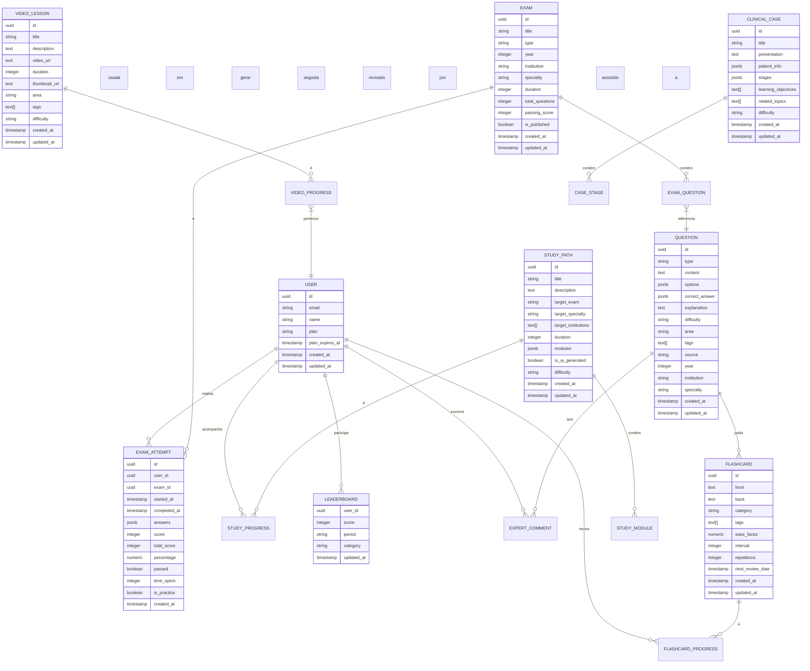
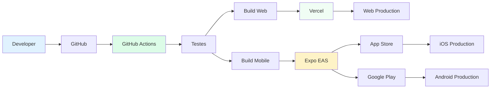
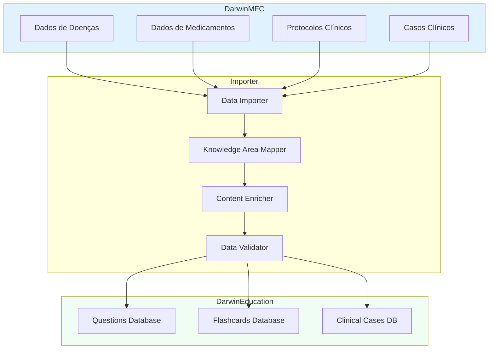

# Darwin Education - Arquitetura Visual (Mermaid)

**Versão:** 1.0.0  
**Data:** 23 de Janeiro de 2026

---

## 📊 Visão Geral do Sistema

---

## 🏗️ Estrutura de Monorepo

```mermaid
graph TB
    ROOT[Darwin Education]

    subgraph Apps
        ROOT --> WEB_APP[apps/web]
        ROOT --> MOBILE_APP[apps/mobile]
    end

    subgraph Packages
        ROOT --> SHARED[packages/shared]
        ROOT --> DATABASE[packages/database]
        ROOT --> UI[packages/ui]
    end

    subgraph Services
        ROOT --> AI_SRV[services/ai]
        ROOT --> NOTIF_SRV[services/notifications]
        ROOT --> PAY_SRV[services/payments]
        ROOT --> ANALYTICS_SRV[services/analytics]
    end

    subgraph Scripts
        ROOT --> DATA_IMPORT[scripts/data-import]
        ROOT --> DEPLOY[scripts/deployment]
    end

    subgraph Docs
        ROOT --> ARCH_DOCS[docs/architecture]
        ROOT --> API_DOCS[docs/api]
        ROOT --> MOBILE_DOCS[docs/mobile]
    end

    style WEB_APP fill:#e0f2fe
    style MOBILE_APP fill:#f0fdf4
    style SHARED fill:#dcfce7
```

---

## 🔄 Fluxo de Dados

### Fluxo de Autenticação

### Fluxo de Simulado

---

## 📱 Arquitetura Mobile

---

## 🗄️ Modelo de Dados

---

## 🚀 Fluxo de Deployment

---

## 🎯 Funcionalidades por Plataforma

```mermaid
graph TB
    subgraph Features
        AUTH[Autenticação]
        QUESTIONS[Banco de Questões]
        SIMULATOR[Simulador de Provas]
        ANALYTICS[Análise de Desempenho]
        STUDY_PATHS[Trilhas de Estudo IA]
        RANKING[Ranking e Gamificação]
        FLASHCARDS[Flashcards SM-2]
        CASES[Casos Clínicos]
        VIDEOS[Vídeo-Aulas]
        PAYMENTS[Pagamentos]
    end

    subgraph Web
        AUTH --> WEB_AUTH[✓]
        QUESTIONS --> WEB_QUESTIONS[✓]
        SIMULATOR --> WEB_SIM[✓]
        ANALYTICS --> WEB_ANAL[✓]
        STUDY_PATHS --> WEB_PATHS[✓]
        RANKING --> WEB_RANK[✓]
        FLASHCARDS --> WEB_FLASH[✓]
        CASES --> WEB_CASES[✓]
        VIDEOS --> WEB_VIDEOS[✓]
        PAYMENTS --> WEB_PAY[✓]
    end

    subgraph Mobile
        AUTH --> MOB_AUTH[✓]
        QUESTIONS --> MOB_QUESTIONS[✓]
        SIMULATOR --> MOB_SIM[✓]
        ANALYTICS --> MOB_ANAL[✓]
        STUDY_PATHS --> MOB_PATHS[✓]
        RANKING --> MOB_RANK[✓]
        FLASHCARDS --> MOB_FLASH[✓]
        CASES --> MOB_CASES[✓]
        VIDEOS --> MOB_VIDEOS[✓]
        PAYMENTS --> MOB_PAY[✓]
        PUSH[Push Notifications]
    end

    style Web fill:#e0f2fe
    style Mobile fill:#f0fdf4
```

---

## 📊 Integração Darwin-MFC

---

**Documento criado por:** Roo (Architect Mode)  
**Última atualização:** 23 de Janeiro de 2026
